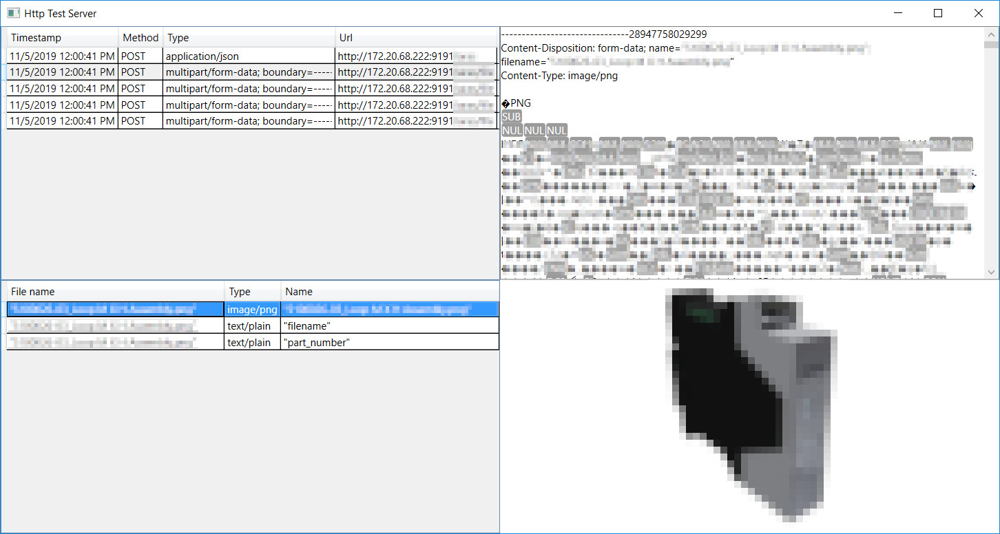

# HTTP Test Server

An HTTP server that saves incoming requests and displays their data.

Limitations:

* It is hard-coded to listen to port 9191.
* The request's content is only displayed as text.
* POST multipart/form-data is only displayed as either text or as an image.

## Screenshots

POST request with JSON data:

POST request with form data, where one of the files is an image:

